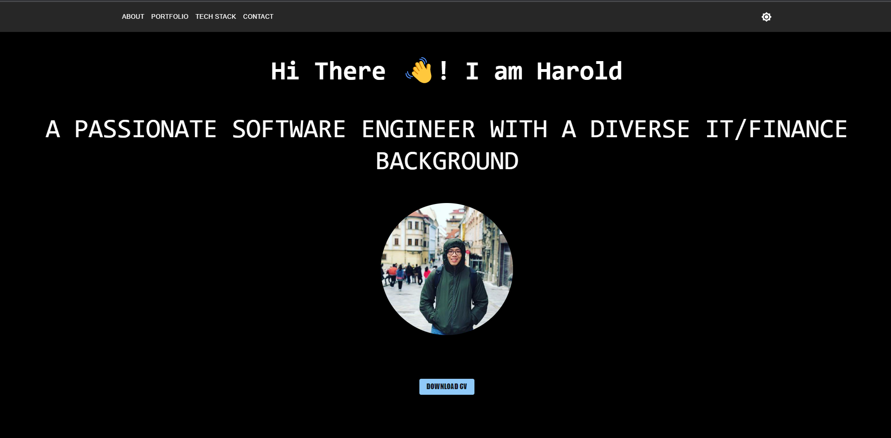

  

<h3 align="center">Portfolio</h3>

## Description

Portfolio project using Vite and Django

## Click <a href="https://github.com/liabilityquek/portfolio-backend">here</a> to view the backend repo.

## Deployment

The application is deployed on Vercel. Click <a href="https://portfolio-frontend-omega-rose.vercel.app/">here</a> to access the application.
The backend is deployed on <a href="https://portfolio-backend-k8gu.onrender.com">Render</a>.

## Technologies & Tools Used

<li>Django</li>
<li>Django Restframwork</li>
<li>Javascript</li>
<li>Material UI</li>
<li>Git commands</li>
<li>React</li>
<li>Postgres</li>
<li>PgAdmin</li>
<li>Vite</li>
<li>JWT</li>
<li>Postman</li>
<li>auth0</li>

 

## References
Various sources which I have seek guidance from:
</li>
<li><a href=https://www.digitalocean.com/community/tutorials/how-to-implement-smooth-scrolling-in-react>Smooth Scrolling in React</a>
</li>
<li><a href=https://codevoweb.com/build-crud-api-with-django-rest-framework>Applying CRUD with django rest-framework</a>
</li>
<li><a href=https://www.js-howto.com/how-to-handle-multiple-queries-with-react-query>React Query</a>
</li>
<li><a href=https://testdriven.io/blog/django-render>Render documentation</a>
</li>
<li><a href=https://render.com/docs/deploy-django#manual-deployment>Deploying Django on Render</a>
</li>
<li><a href=https://medium.com/geekculture/how-to-create-and-connect-to-a-postgresql-database-with-render-and-pgadmin-577b326fd19d#id_token=eyJhbGciOiJSUzI1NiIsImtpZCI6IjJkOWE1ZWY1YjEyNjIzYzkxNjcxYTcwOTNjYjMyMzMzM2NkMDdkMDkiLCJ0eXAiOiJKV1QifQ.eyJpc3MiOiJodHRwczovL2FjY291bnRzLmdvb2dsZS5jb20iLCJuYmYiOjE2ODQ4OTU2NDYsImF1ZCI6IjIxNjI5NjAzNTgzNC1rMWs2cWUwNjBzMnRwMmEyamFtNGxqZGNtczAwc3R0Zy5hcHBzLmdvb2dsZXVzZXJjb250ZW50LmNvbSIsInN1YiI6IjEwMTQ4NDk3NDQ4OTEyNTg2ODUzNyIsImVtYWlsIjoiaGFyb2xkcXVla2hlcmVAZ21haWwuY29tIiwiZW1haWxfdmVyaWZpZWQiOnRydWUsImF6cCI6IjIxNjI5NjAzNTgzNC1rMWs2cWUwNjBzMnRwMmEyamFtNGxqZGNtczAwc3R0Zy5hcHBzLmdvb2dsZXVzZXJjb250ZW50LmNvbSIsIm5hbWUiOiJoYXJvbGQgcXVlayIsInBpY3R1cmUiOiJodHRwczovL2xoMy5nb29nbGV1c2VyY29udGVudC5jb20vYS9BQWNIVHRjaU1FY21NMDFfeHViUXdla19MUU5NWEtaWlNtRmNKNldFLWRWVj1zOTYtYyIsImdpdmVuX25hbWUiOiJoYXJvbGQiLCJmYW1pbHlfbmFtZSI6InF1ZWsiLCJpYXQiOjE2ODQ4OTU5NDYsImV4cCI6MTY4NDg5OTU0NiwianRpIjoiYzI4OTQ2YWM3NjZkMmE1ODg5NWYwMWFkMmIzN2RmMzhlZTFmNzY5YyJ9.w8K2bIqn5mg-KuqYav-k9HtRXeZnqX5yzh0bXLuuThlZu2DzUzkoQadZI165Z_VkkB4TEynXl-kEZcTDTArHMen9oEsXa6iIZWn3nrDqlqh56pS-q66lADK1axTDZeYU2j4ueGdYmTLzXhpgl7kYnx9NgVgRDwf64HCBnjlFjKpF_7YGmCh5XgTqRVYQALzpIyIHDoKAiZTjSFqZYpc1I_DKnGxtRQc2k7fb-Tl-SkMHe7U9B_6w-KE2hT7zCoPFHpn1fmwGrmMGeA1hHK11dAUFY1p_-Cc73bdMPVMscGKHDuT_NFRElrVWimr4qZzLOgduFXbC42Mj9JSHj7wKVQ>How to Create and Connect to a PostgreSQL Database With Render and pgAdmin</a>
</li>
<li><a href=https://www.stackhawk.com/blog/django-csrf-protection-guide/#:~:text=The%20CSRF%20token%20is%20like,present%20in%20all%20outgoing%20requests.>Applying CSRF protection on Django</a>
</li>
<li><a href=https://medium.com/hackernoon/automatically-set-csrf-token-in-postman-django-tips-c9ec8eb9eb5b>Setting CSRF token in postman</a>
</li>
<li><a href=https://code.visualstudio.com/docs/python/tutorial-django>Setting up a Django project</a>
</li>
<li><a href=https://render.com/docs/deploy-django#manual-deployment>Deploying Django on Render</a>
</li>
<li><a href=https://community.auth0.com/t/i-getting-expecting-a-pem-formatted-key/52055/6>Django authentication for JWT Token from Auth0</a>
</li>
<li><a href=https://www.programcreek.com/python/example/81618/rest_framework.authentication.get_authorization_header>Django rest-framework authentication</a>
</li>
<li><a href=https://testdriven.io/blog/django-render>Deploying Postgres on Render</a>
</li>
